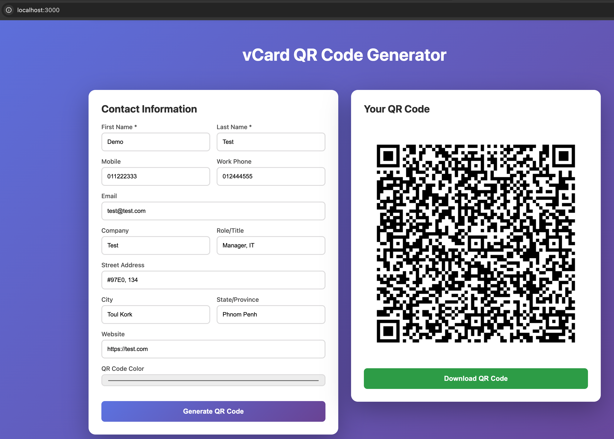

# vCard QR Code Generator - in Rust

A full-stack Rust application that generates QR codes from vCard contact information with SQLite persistence.
This is for learning purpose only.

## Features

- ✅ Generate vCard QR codes with contact details
- ✅ Support for multiple contact fields (name, phone, email, address, company)
- ✅ Custom QR code colors
- ✅ Download QR codes as PNG
- ✅ Responsive web interface
- ✅ Real-time QR generation
- ✅ SQLite database persistence with automatic migrations
- ✅ All submissions stored with timestamps for record keeping



## Tech Stack

- **Backend**: Axum (async Rust web framework)
- **Database**: SQLite with SQLx (async SQL toolkit)
- **QR Generation**: qrcode crate
- **Image Processing**: image crate
- **Frontend**: Vanilla HTML/CSS/JavaScript

## Installation

1. Install Rust:
```bash
curl --proto '=https' --tlsv1.2 -sSf https://sh.rustup.rs | sh
source $HOME/.cargo/env
```

2. Clone/navigate to project:
```bash
cd vcard-qr-generator
```

3. Build and run:
```bash
cargo build --release
cargo run --release
```

The application will automatically:
- Create the SQLite database (`vcards.db`)
- Apply all pending migrations
- Start the web server

4. Open browser:
```
http://127.0.0.1:3000
```

## Usage

1. Fill in contact information:
   - Required: First Name, Last Name
   - Optional: Mobile, Work phone, Email, Company, Role, Street, City, State, Website

2. Choose QR code color (default: black)

3. Click "Generate QR Code"
   - Contact data is saved to the database
   - QR code is generated and displayed

4. Download the generated QR code

## API Endpoint

**POST** `/api/generate`

Request body:
```json
{
  "first_name": "John",
  "last_name": "Doe",
  "mobile": "+1234567890",
  "email": "john@example.com",
  "company": "Tech Corp",
  "role": "Software Engineer",
  "website": "https://johndoe.com",
  "color": "#000000"
}
```

Response:
```json
{
  "image": "data:image/png;base64,..."
}
```

## Project Structure

```
vcard-qr-generator/
├── Cargo.toml              # Dependencies
├── src/
│   └── main.rs             # Backend server with DB integration
├── static/
│   └── index.html          # Frontend UI
├── migrations/
│   └── 001_create_vcards_table.sql  # Database schema
├── vcards.db               # SQLite database (auto-created)
├── DATABASE.md             # Database documentation
└── CLAUDE.md               # Development guide
```

## Key Components

### Backend (main.rs)
- **init_database()**: Creates/connects to SQLite database
- **run_migrations()**: Applies pending database migrations
- **generate_vcard()**: Creates vCard 3.0 format string
- **generate_qr()**: Saves to DB and generates QR code with color support
- **serve_index()**: Serves HTML frontend

### Frontend (index.html)
- Responsive form for contact data
- Color picker for QR customization
- Real-time QR generation
- Download functionality

## Dependencies

```toml
axum = "0.7"              # Web framework
tokio = "1"               # Async runtime
sqlx = "0.8"              # Async SQL with SQLite support
chrono = "0.4"            # Date/time handling
qrcode = "0.14"           # QR code generation
image = "0.25"            # Image processing
base64 = "0.22"           # Base64 encoding
serde = "1"               # Serialization
```

## Development

Run in dev mode:
```bash
cargo run
```

Build optimized:
```bash
cargo build --release
./target/release/vcard-qr-generator
```

### Database Operations

View stored vcards:
```bash
sqlite3 vcards.db "SELECT * FROM vcards ORDER BY created_at DESC LIMIT 10;"
```

Count total records:
```bash
sqlite3 vcards.db "SELECT COUNT(*) FROM vcards;"
```

See [DATABASE.md](DATABASE.md) for complete database documentation.

## License

MIT
